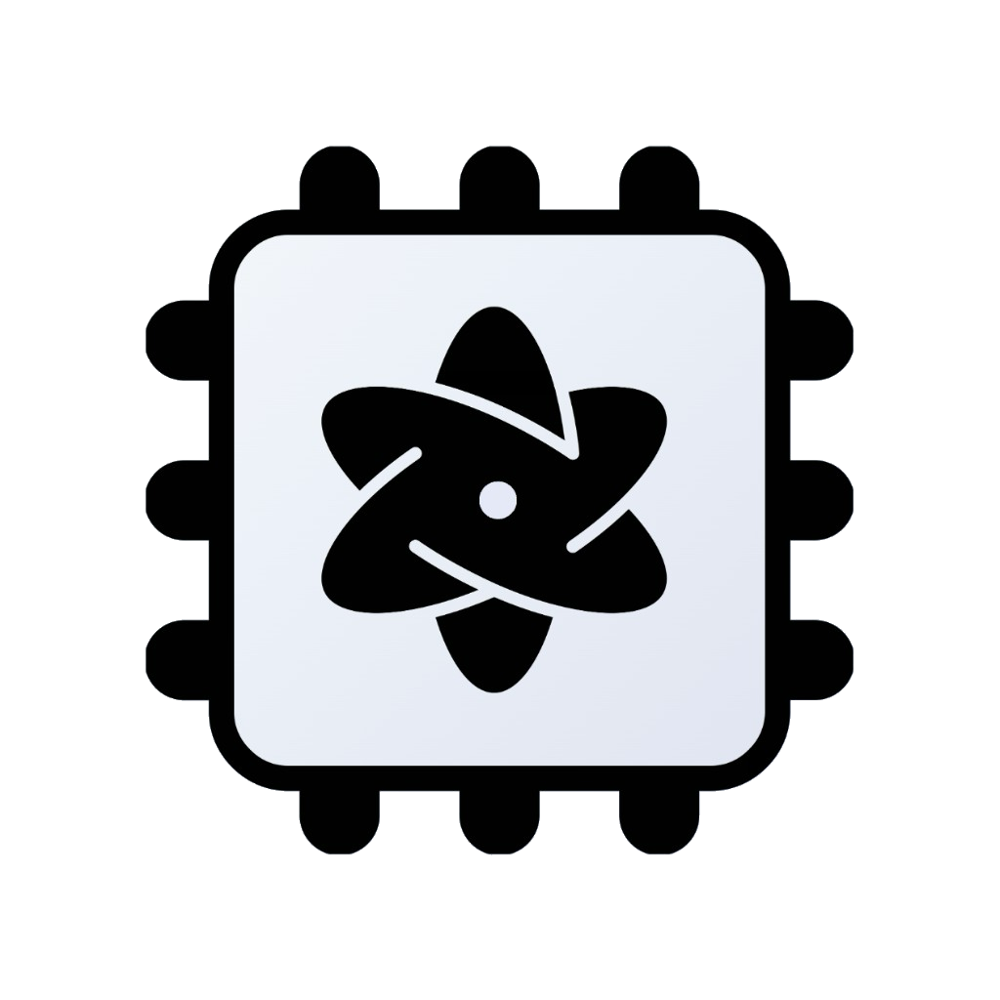
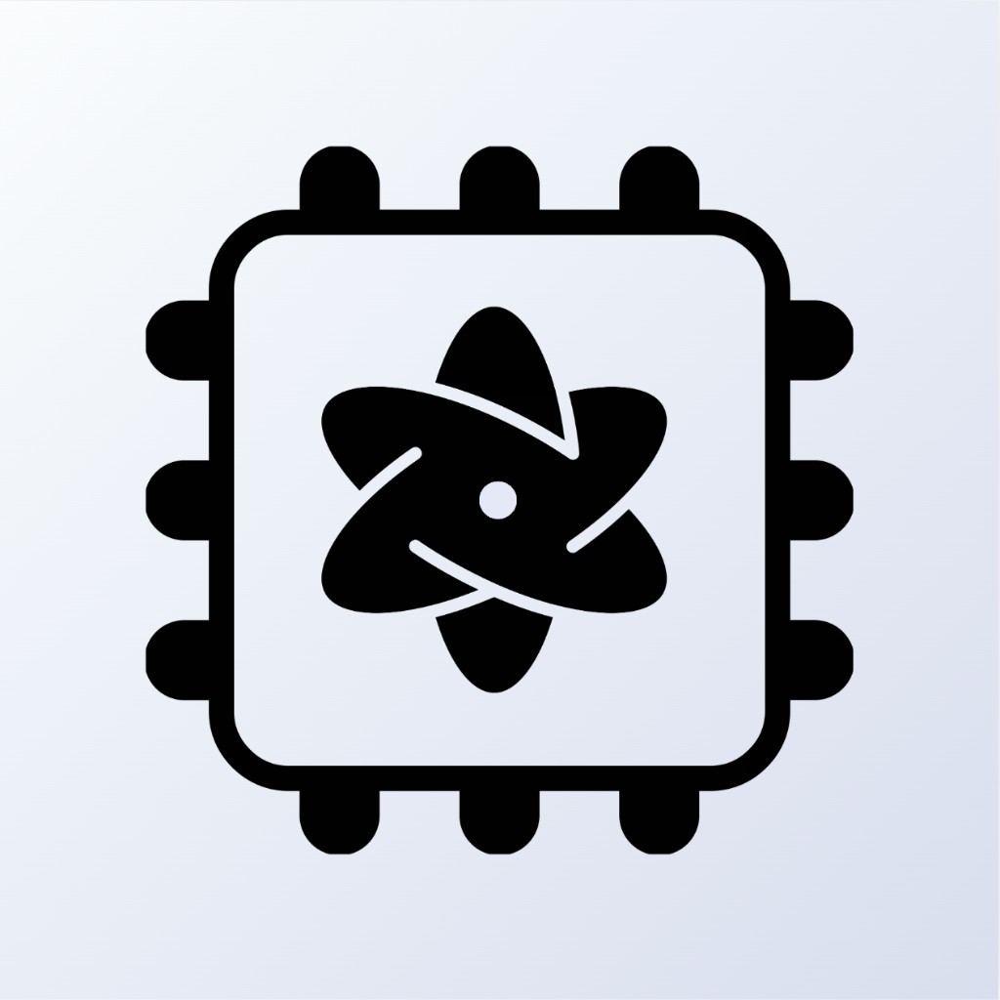

<p align="center">
  
</p>

# QuantumKit

Swift package for on-device quantum circuit simulation on Apple silicon. Metal statevector and density-matrix engines, CPU fallback. Version 1.0.0. macOS 13+, iOS 16+. One product: `QuantumKit`.

[Docs](Sources/QuantumKit/QuantumKit.docc/QuantumKit.md) · [App](#app)

Runs in your app process. No Python, no cloud backend.

## Why

`QuantumBackendFactory.makeRecommended` picks Metal when a GPU is there, otherwise CPU. Noiseless circuits with trailing measurements evolve once, then sample — time follows width and gates, not shot count. OpenQASM 2 and a core OpenQASM 3 subset import into the same IR.

Stabilizer and MPS exist if you construct them. The width-only recommender never selects them. Default is statevector; noise uses density matrix or trajectory when that still fits.

## Limits

| Path | Max qubits |
| --- | ---: |
| Metal statevector | 31 (`StateVector.maxQubitCount`) |
| CPU statevector | 16 |
| Metal density matrix | 14 |
| CPU density matrix | 8 |

n = 30 is about 8 GB of amplitude buffers. Host prepared-sampling copies a `2ⁿ` CDF only for n ≤ 20; wider Metal shots keep the map on the GPU and return a histogram. Mid-circuit `Gate.measure` and `Gate.c_if` are serial (not in the tables below).

First Metal run at a width compiles shaders — time the next one. Start with Bell or GHZ-4. n ≈ 30 is a memory stress test.

## Install

```swift
dependencies: [
    .package(url: "https://github.com/acemoglu/QuantumKit.git", from: "1.0.0")
]
```

```swift
.target(
    name: "MyApp",
    dependencies: [
        .product(name: "QuantumKit", package: "QuantumKit")
    ]
)
```

`from: "1.0.0"` needs a git tag matching `QuantumKitInfo.version`. Until that tag exists, add from `main`.

Xcode: File → Add Package Dependencies… → `https://github.com/acemoglu/QuantumKit.git` → add **QuantumKit**. `import QuantumKit`.

## Quickstart

`bitstringCounts` uses MSB keys (leftmost character is the highest-index qubit).

```swift
import QuantumKit

var circuit = try QuantumCircuit(qubitCount: 2)
try circuit.h(0)
try circuit.cx(0, 1)
try circuit.measure(0)
try circuit.measure(1)

let backend = try QuantumBackendFactory.makeRecommended(circuit: circuit)
let result = try backend.run(
    circuit: circuit,
    options: QuantumRunOptions(seed: 1, shots: 1024)
)
print(result.bitstringCounts ?? [:])
// Typical support: "00" and "11"
```

The factory returns `any QuantumBackend`, so pass `QuantumRunOptions` explicitly.

OpenQASM, backends, noise, sampler/estimator: [docs](Sources/QuantumKit/QuantumKit.docc/QuantumKit.md).

## Gates

`QuantumCircuit` helpers match `Gate`. `u(θ, φ, λ)` is Qiskit-style U / U3.

| Kind | Gates |
| --- | --- |
| 1Q | `h`, `x`, `y`, `z`, `s` / `sdg`, `t` / `tdg`, `sx` / `sxdg`, `id`, `p`, `u`, `rx`, `ry`, `rz` |
| 2Q | `cx`, `cz`, `swap`, `iswap`, `ecr`, `dcx`, `cp`, `crx`, `cry`, `crz`, `rxx`, `ryy`, `rzz` |
| 3Q+ | `ccx`, `cswap`, `mcx`, `mcz` |
| Other | `measure`, `reset`, `barrier`, `delay`, `c_if`, `while_c`, `initialize`, `unitary1`, `customUnitary` |

## App

<p align="center">
  
</p>

<p align="center">
  <a href="https://apps.apple.com/app/quantumkit"></a>
</p>

Visual circuit editor for **Mac** and **iPhone / iPad**. Drag gates onto wires or write OpenQASM, then run locally on this library.

[How to use the app](Apps/QuantumKitPlayground/README.md)

## Benchmarks

18 August 2026, this machine: MacBook Pro (MacBookPro18,2), Apple M1 Max (8P + 2E), 64 GB. macOS 26.5.2 (25F84). Xcode 26.0 (17A324), Swift 6.2. QuantumKit 1.0.0. Device: `Apple M1 Max`.

Metal, seed 1. First run per width discarded. Median of five `backend.run` times after that.

Bell = H+CX+measure. GHZ(*n*) = H on qubit 0, CX chain, measure all. QFT(*n*) = textbook H then native `CP(π/2^{k−j})`, measure all (no bit-reversal swaps). Noisy row: `NoiseModel(depolarizingProbability: 0.01)`.

| Circuit | n | Gates | Shots | Method | Median (ms) | Min–max (ms) |
| --- | ---: | ---: | ---: | --- | ---: | --- |
| Bell | 2 | 4 | 1024 | Statevector | 0.63 | 0.50–0.69 |
| GHZ | 4 | 8 | 1024 | Statevector | 0.70 | 0.57–2.06 |
| GHZ | 12 | 24 | 1024 | Statevector | 0.91 | 0.81–2.32 |
| GHZ | 16 | 32 | 1024 | Statevector | 1.40 | 1.21–3.67 |
| GHZ | 20 | 40 | 1024 | Statevector | 5.21 | 4.78–5.69 |
| GHZ | 16 | 32 | 8192 | Statevector | 2.31 | 2.04–4.86 |
| QFT | 8 | 44 | 1024 | Statevector | 1.91 | 1.22–2.57 |
| QFT | 12 | 90 | 1024 | Statevector | 2.63 | 2.42–5.35 |
| QFT | 16 | 152 | 1024 | Statevector | 5.56 | 4.64–6.43 |
| GHZ, depolarizing *p*=0.01 | 8 | 16 | 1024 | Density matrix | 6.92 | 4.56–7.66 |

GHZ-16: 1.40 ms at 1024 shots, 2.31 ms at 8192 — not 8×. Extra shots add sampling work; the unitary is not replayed.

Same GHZ-12 on CPU: 0.35 ms median (0.35–0.43). At that width Metal launch can cost more than CPU.

GHZ-24: 38.2 ms median (34.3–63.9). n = 30 was not run.

Published CUDA/cuStateVec benchmarks on server hardware (A100/EPYC) measure different targets; QuantumKit focuses strictly on local in-process execution on Apple silicon.

## Status

1.0.0 (`QuantumKitInfo.version`). Released under the [Apache 2.0 License](LICENSE).
